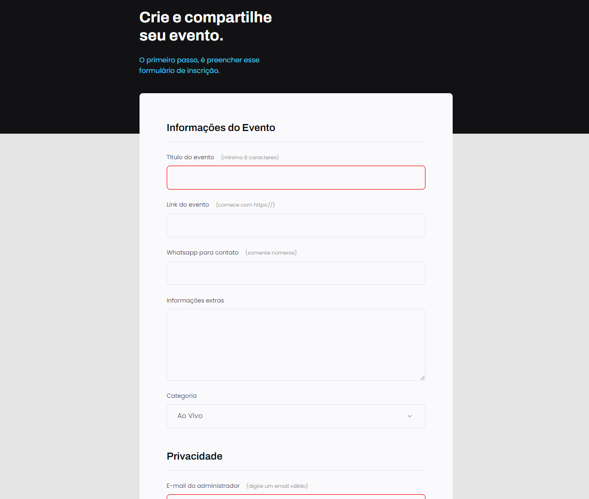

<h1 align="center"> Formulário </h1>

formulários online são ferramentas usadas no marketing digital para capturar dados fornecidos por um potencial cliente.  

  <a href="#-tecnologias">Tecnologias</a>&nbsp;&nbsp;&nbsp;|&nbsp;&nbsp;&nbsp;
  <a href="#-projeto">Projeto</a>&nbsp;&nbsp;&nbsp;|&nbsp;&nbsp;&nbsp;
  <a href="#-layout">Layout</a>&nbsp;&nbsp;&nbsp;|&nbsp;&nbsp;&nbsp;
  <a href="#memo-licença">Licença</a>

  

 

  

## 🚀 Tecnologias

Esse projeto foi desenvolvido com as seguintes tecnologias:

- HTML e CSS
- Git e Github
- Figma

## 💻 Projeto

Formulário criado para capturar dados fornecidos pelo cliente.

- [Acesse o projeto finalizado, online](https://name-less-dev.github.io./Formulario/)

## 🔖 Layout

Você pode visualizar o layout do projeto através [DESSE LINK](https://www.figma.com/file/jF9qgMzYzecuUrPwNs1RlQ/Explorer-Stage-03-Projeto-01-(Copy)?type=design&node-id=0-1&mode=design&t=1xuYRIpTMlFbEnZi-0). É necessário ter conta no [Figma](https://figma.com) para acessá-lo.

## Licença

Esse projeto está sob a licença MIT.

---

Feito por Matheus A. Bezerra

[Linkedin](https://www.linkedin.com/in/matheus-araujo-bezerra/)
